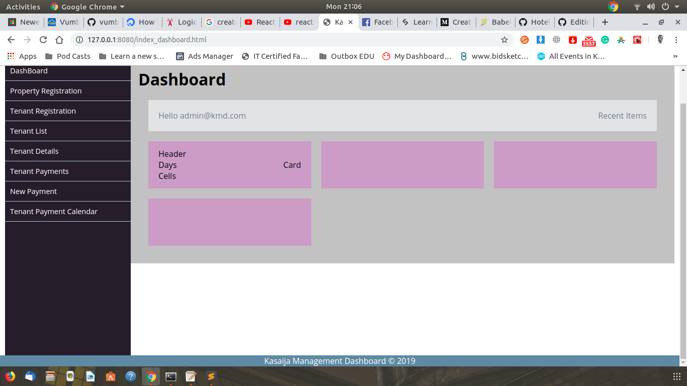

# Kasaija Property Management Dashboard

Author
=======

* __[Denis Kisina](https://github.com/Denis-kisina/)__
* __[Denis Ahimbisibwe](https://github.com/Denis774/)__

date: 16/July/209

## Description
Kasaija Management syste is designed for residential or commercial property management.

## Features
1. Billing and Payments
2. Tenant Registration
3. Property Registaration
4. Database to store property details
5. User Registration

## Technologies Used
⋅⋅* HTML&CSS
⋅⋅* Bootstrap
⋅⋅* JavaScript & Jquery
⋅⋅* React
## Login Details

user email: admin@kmd.com
password: admin

